# easing

Processing sketch exploring Robert Penners easing functions 

## images

### Back easeIn
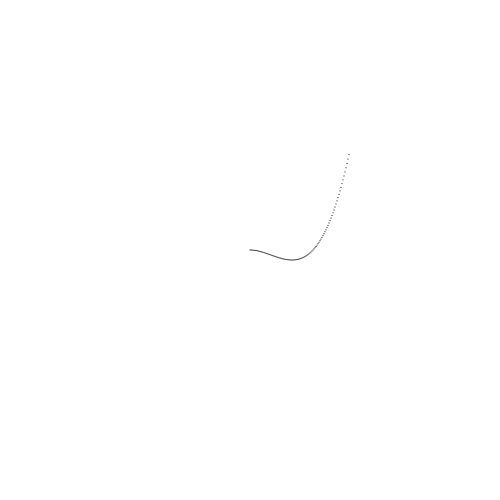  

### Back easeInOut
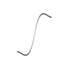  

### Back easeOut
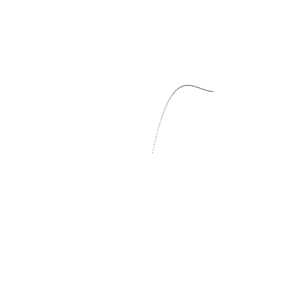  

### Bounce easeIn
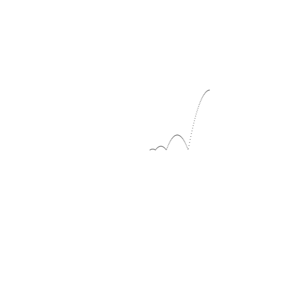  

### Bounce easeInOut
  

### Bounce easeOut
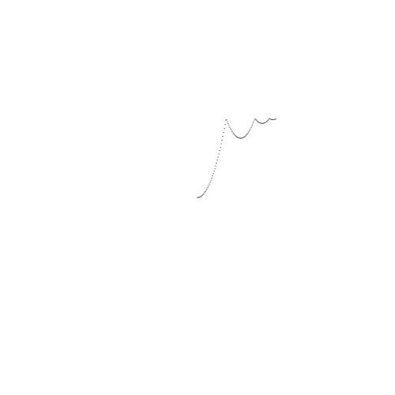  

### Circ easeIn
  

### Circ easeInOut
  

### Circ easeOut
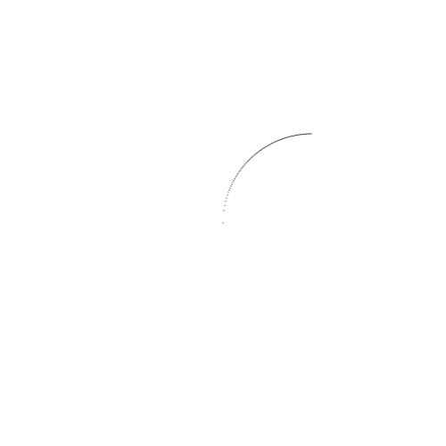  

### Cubic easeIn
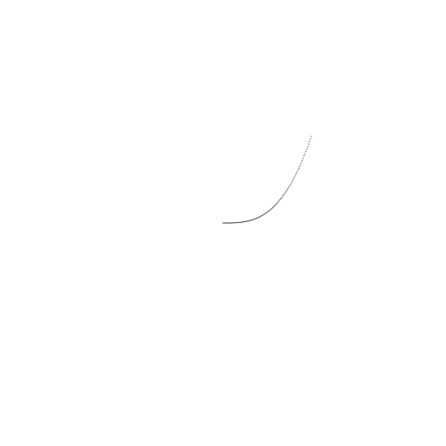  

### Cubic easeInOut
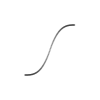  

### Cubic easeOut
  

### Elastic easeIn
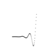  

### Elastic easeInOut
  

### Elastic easeOut
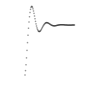  

### Expo easeIn
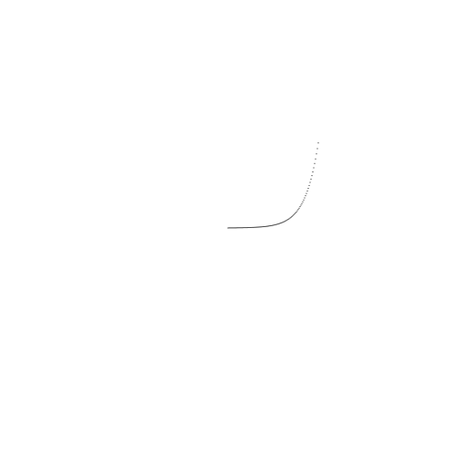  

### Expo easeInOut
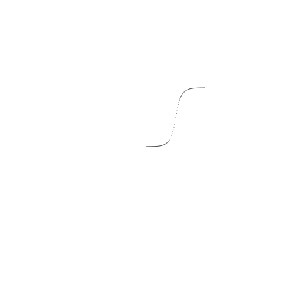  

### Expo easeOut
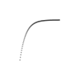  

### Linear easeIn
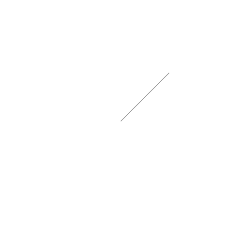  

### Linear easeInOut
  

### Linear easeOut
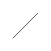  

### Quad easeIn
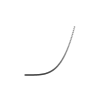  

### Quad easeInOut
  

### Quad easeOut
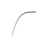  

### Quart easeIn
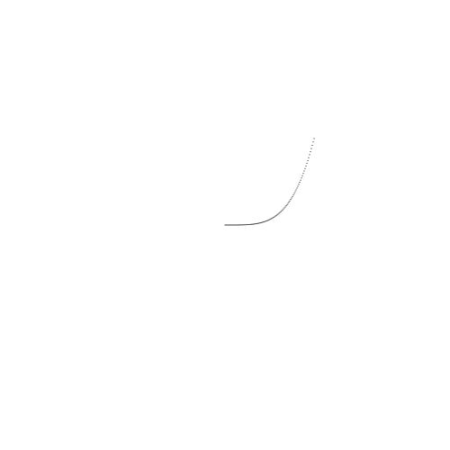  

### Quart easeInOut
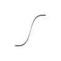  

### Quart easeOut
  

### Quint easeIn
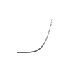  

### Quint easeInOut
  

### Quint easeOut
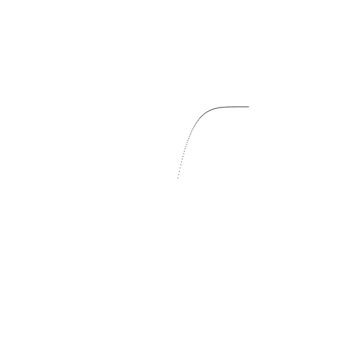  

### Sine easeIn
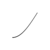  

### Sine easeInOut
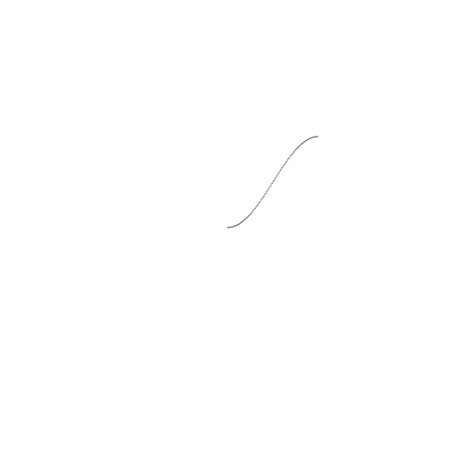  

### Sine easeOut
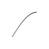  

## LICENSE

Copyright © 2001 Robert Penner All rights reserved.
- Redistribution and use in source and binary forms, with or without modification, are permitted provided that the following
conditions are met:

- Redistributions of source code must retain the above copyright notice,
    this list of conditions and the following disclaimer.
- Redistributions in binary form must reproduce the above copyright notice, this list of
    conditions and the following disclaimer in the documentation and/or
    other materials provided with the distribution.
- Neither the name of the author nor the names of contributors may be used to
    endorse or promote products derived from this software without specific
    prior written permission.

THIS SOFTWARE IS PROVIDED BY THE COPYRIGHT HOLDERS
AND CONTRIBUTORS "AS IS" AND ANY EXPRESS OR IMPLIED WARRANTIES,
INCLUDING, BUT NOT LIMITED TO, THE IMPLIED WARRANTIES OF
MERCHANTABILITY AND FITNESS FOR A PARTICULAR PURPOSE ARE DISCLAIMED. IN
NO EVENT SHALL THE COPYRIGHT OWNER OR CONTRIBUTORS BE LIABLE FOR ANY
DIRECT, INDIRECT, INCIDENTAL, SPECIAL, EXEMPLARY, OR CONSEQUENTIAL
DAMAGES (INCLUDING, BUT NOT LIMITED TO, PROCUREMENT OF SUBSTITUTE GOODS
OR SERVICES; LOSS OF USE, DATA, OR PROFITS; OR BUSINESS INTERRUPTION)
HOWEVER CAUSED AND ON ANY THEORY OF LIABILITY, WHETHER IN CONTRACT,
STRICT LIABILITY, OR TORT (INCLUDING NEGLIGENCE OR OTHERWISE) ARISING
IN ANY WAY OUT OF THE USE OF THIS SOFTWARE, EVEN IF ADVISED OF THE
POSSIBILITY OF SUCH DAMAGE.
